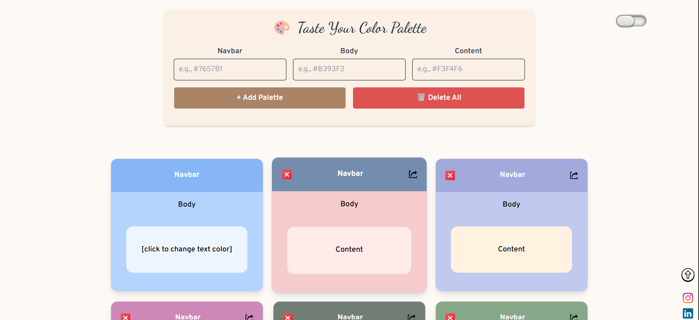
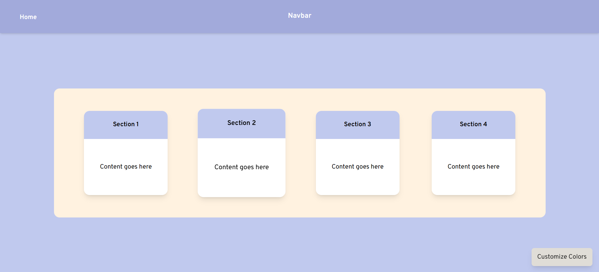

# 🎨 Tasting Palettes

Tasting Palettes is a creative color palette web app where users can **design, preview, and manage custom color themes** for UI elements like Navbar, Body, and Content sections.

Built with **React + Vite**, this is my first fully self-made project where I explored localStorage, dark mode, custom themes, and interactive UI/UX using TailwindCSS and Framer Motion.

> ✨ Try the live demo: [tasting-palettes.vercel.app](https://tasting-palettes.vercel.app)

---

## 🖼️ Features

- 🎨 **Add custom color palettes**
- 🌓 **Toggle Dark/Light theme** (with saved preference)
- 💾 **Save palettes to localStorage**
- 🔄 **Edit palette details on a separate Experience page**
- 🧹 **Delete individual or all palettes**
- 🎯 **Live color preview with animations**
- 📱 **Fully responsive design**
- 🖱️ Custom UI cursor and hover effects

---

## 🚀 Tech Stack

- ⚛️ **React**
- ⚡ **Vite**
- 🎨 **TailwindCSS**
- 💫 **Framer Motion**
- 🧠 **UUID** (for unique palette IDs)
- 🧭 **React Router**
- 💾 **LocalStorage**

---

## 📷 Screenshots

| Home Page | Experience Page |
|-----------|-----------------|
|  |  |

---

## 📂 Project Structure

```txt
src/
├── components/
│   ├── PaletteCard.jsx
│   ├── Theme_btn.jsx
│   └── RandomPalette.js
├── pages/
│   ├── Home.jsx
│   └── Experience.jsx
├── index.css
├── App.jsx
├── main.jsx
```

---

## 🛠️ Getting Started

To run this project locally:

```bash
# Clone the repo
git clone https://github.com/your-username/tasting-palettes.git
cd tasting-palettes

# Install dependencies
npm install

# Run in dev mode
npm run dev

```

## 📦 Deployment
This app is deployed on Vercel. You can easily connect your GitHub repo and redeploy with every commit.

## 📜 License
This project is licensed under the MIT License.

## 🙋‍♂️ Author
Made with ❤️ by [Adeel Ahmad](https://www.linkedin.com/in/adeel-bot)  
Follow me on [Instagram](https://www.instagram.com/adeel_bot)